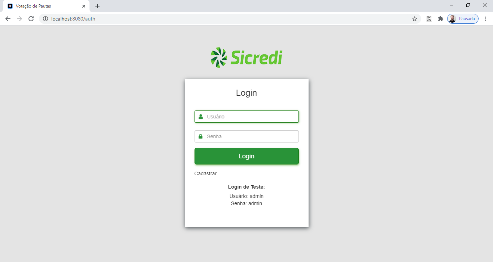
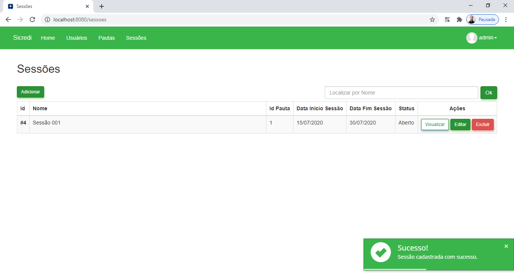
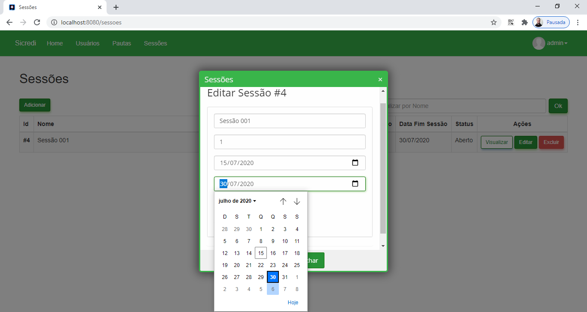
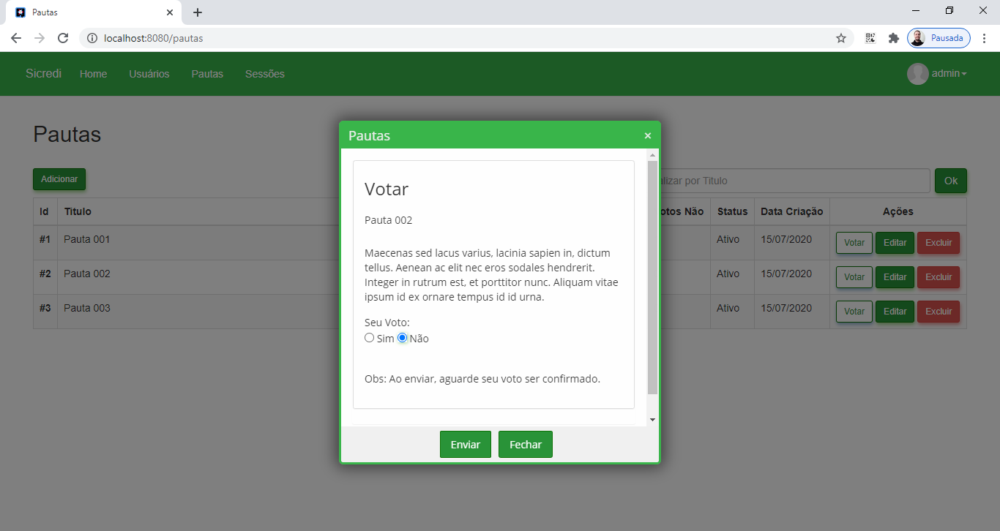
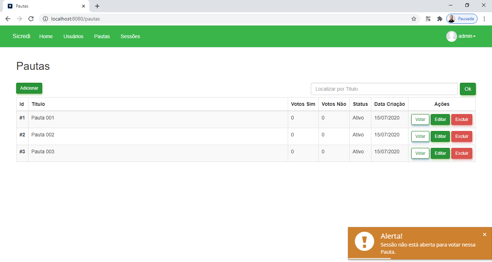
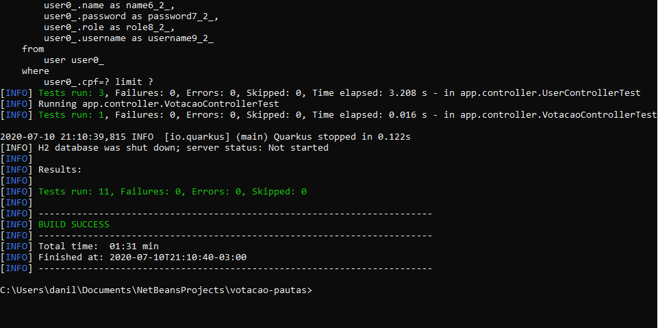

# Votação de Pautas

Avaliação técnica de um sistema de votação de Pautas, desenvolvido em Java com Quarkus.

## Características

- CRUD
- API RESTful
- ACL
- Login
- Validation
- Filter
- Modal
- Notification
- Responsive
- JUnit

## Requisitos

- Java JDK 14
- Apache Maven >= 3.6.3

## Tecnologias

- Java
- Maven
- Quarkus
- Hibernate
- JWT
- Qute
- JAX-RS
- OpenAPI
- Swagger
- CSS
- Jquery
- Lobibox
- Bootstrap
- H2

## Instalação

```
$ git clone https://github.com/danilomeneghel/votacao-pautas.git

$ cd votacao-pautas
```

Para rodar a aplicação digite:

```
$ mvn quarkus:dev
```

Aguarde carregar todo o serviço web. <br>
Após concluído, abra o seu navegador o seguinte endereço: <br>

http://localhost:8080/

## JWT

Para gerar novas chaves privada e pública, execute o seguinte comando: 

- Chave Privada:
```
openssl req -newkey rsa:2048 -new -nodes -keyout privatekey.pem -out csr.pem
```

- Chave Pública:
```
openssl rsa -in privatekey.pem -pubout > publickey.pem
```

Após feito isso, copie os arquivos privatekey.pem e publickey.pem para a pasta "src/main/resources".

## Swagger 

Documentação da API RESTful: <br>

http://localhost:8080/swagger-ui

## Demonstração

http://votacao-pautas.herokuapp.com/ <br>

## Licença

Projeto licenciado sob <a href="LICENSE">Apache License</a>.

## Screenshots

<br><br>
<br><br>
<br><br>
<br><br>
<br><br>
<br><br>
<br><br>
<br><br>
<br><br>

## Testes

Para testar, execute o seguinte comando no terminal: <br>

```
$ mvn test
```

<br><br>


Desenvolvido por<br>
Danilo Meneghel<br>
danilo.meneghel@gmail.com<br>
http://danilomeneghel.github.io/<br>
