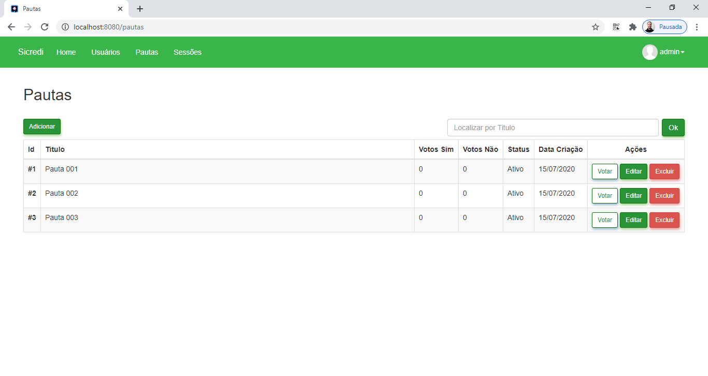

# Votação Pautas

Avaliação técnica de um sistema de votação de Pautas, desenvolvido em Java com Quarkus.

## Características

- CRUD
- API RESTful
- Validation
- Filter
- Responsive
- JUnit

## Requisitos

- Java JDK 1.8
- Apache Maven >= 3.6.3

## Tecnologias

- Java
- JPA
- Maven
- Quarkus
- Hibernate
- Qute
- OpenAPI
- Swagger
- CSS
- Jquery
- Bootstrap
- H2

## Instalação

```
$ git clone https://github.com/danilomeneghel/votacao-pautas.git

$ cd votacao-pautas
```

Para rodar a aplicação digite:

```
$ mvn quarkus:dev
``` 

Aguarde carregar todo o serviço web. <br>
Após concluído, abra o seu navegador o seguinte endereço: <br>

http://localhost:8080/

## Demonstração

https://votacao-pautas.herokuapp.com/ <br>

## Swagger 

Documentação da API RESTful: <br>

https://votacao-pautas.herokuapp.com/swagger-ui

## Licença

Projeto licenciado sob <a href="LICENSE">Apache License</a>.

## Screenshots

<br><br>
<br><br>


Desenvolvido por<br>
Danilo Meneghel<br>
danilo.meneghel@gmail.com<br>
http://danilomeneghel.github.io/<br>
